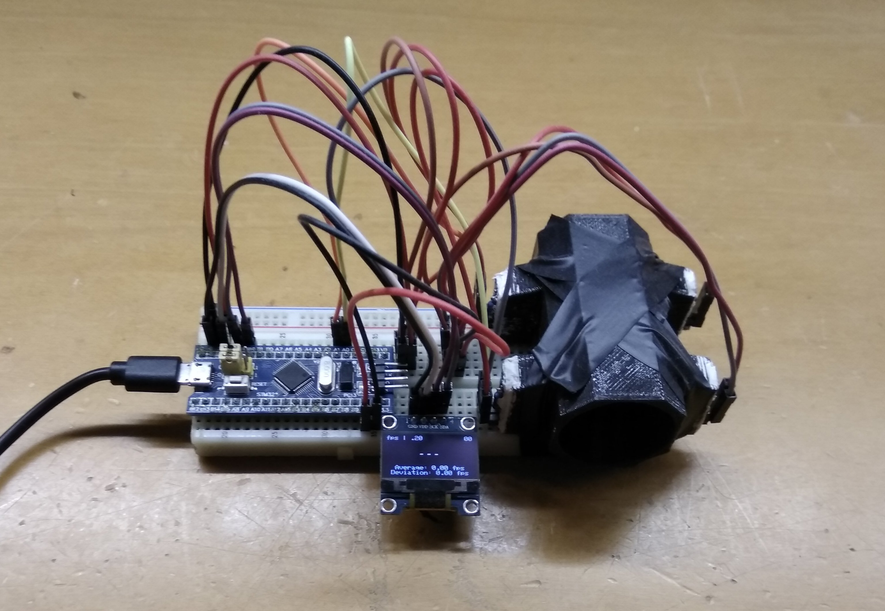

# stm32chrono

**Work in progress!**

This is code I've developed for an STM32-based (STM32F103) Airsoft (or other?) chronograph.  
There are still some issues to iron out, but it is in a working state.

Uses [libopencm3](https://github.com/libopencm3/libopencm3), and my [stm32core](https://github.com/gkatev/stm32core).

Prototype:

